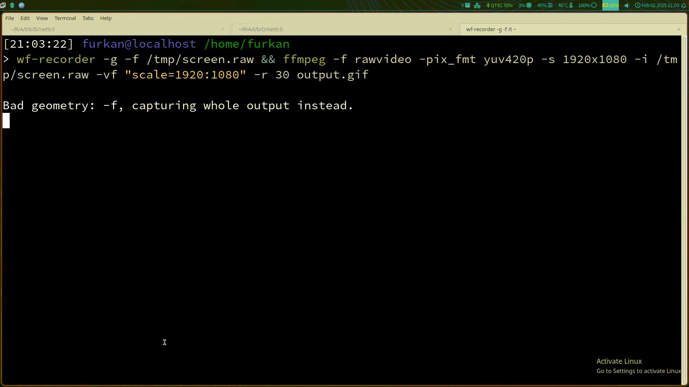

# Infinite Craft Clone CLI

A Basic Infinite Craft Clone Using Ollama and C#

I made this clone using C# and OllamaSharp.

## Hardware Requirements
- 16 GB RAM
- 11 GB Storage

## Software Requirements

- **Ollama:** Make sure you have Ollama installed on your system to play this CLI game.

## Credits:

[Furkan Demirhan](https://github.com/FurkanDemirhan/) - Coding This Clone

awaescher - [OllamaSharp](https://github.com/awaescher/OllamaSharp)

Neal Agarwal - [Original Game](https://neal.fun/infinite-craft/)

tomakita - [Colorful.Console](https://github.com/tomakita/Colorful.Console)
